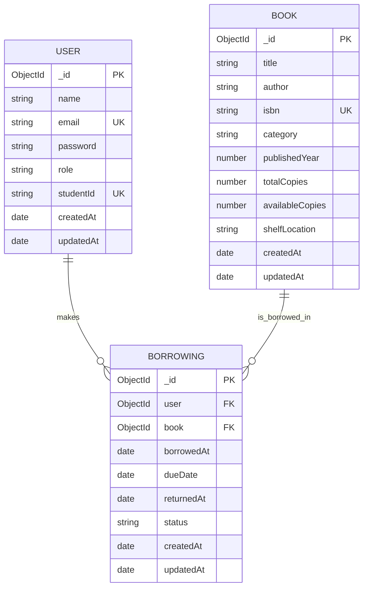

# Student Library System ER Diagram

## Relationships

- One `User` can have many `Borrowing` records.
- One `Book` can appear in many `Borrowing` records.
- Each `Borrowing` record belongs to exactly one `User` and one `Book`.
- `Borrowing.status` can be `booked`, `borrowed`, or `returned`.
